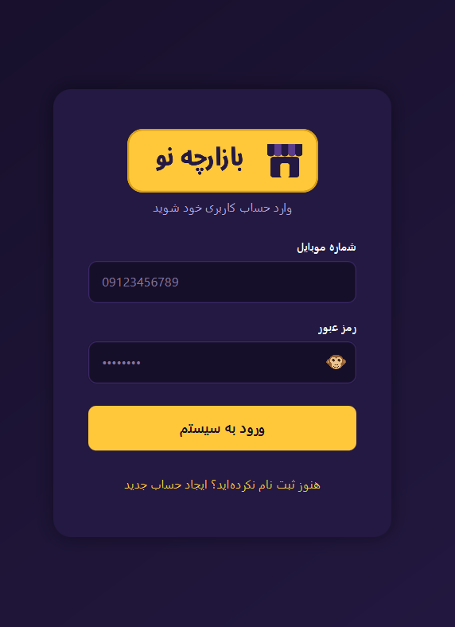
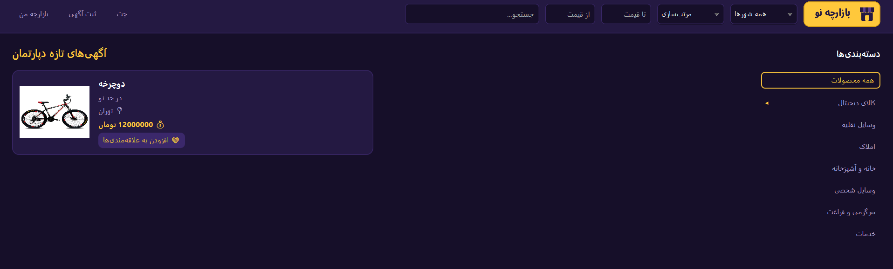
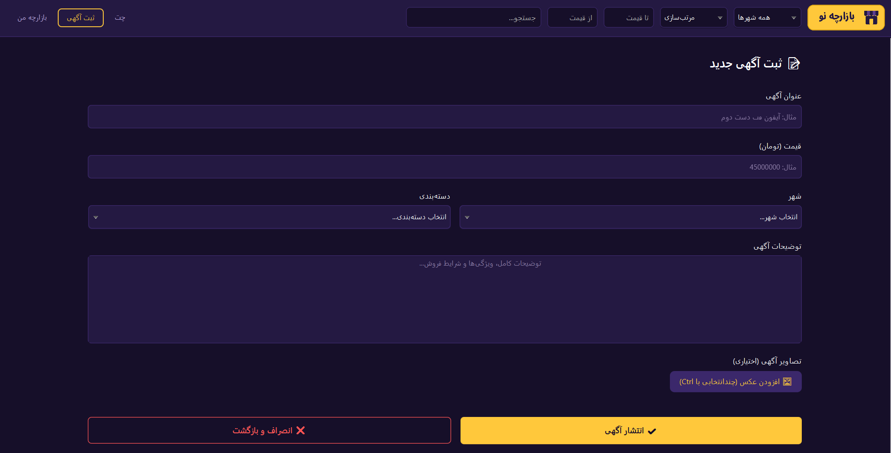
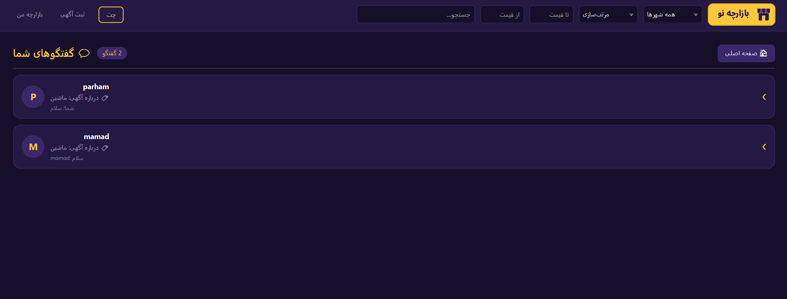
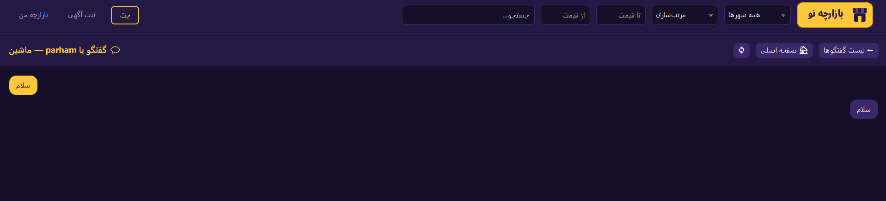
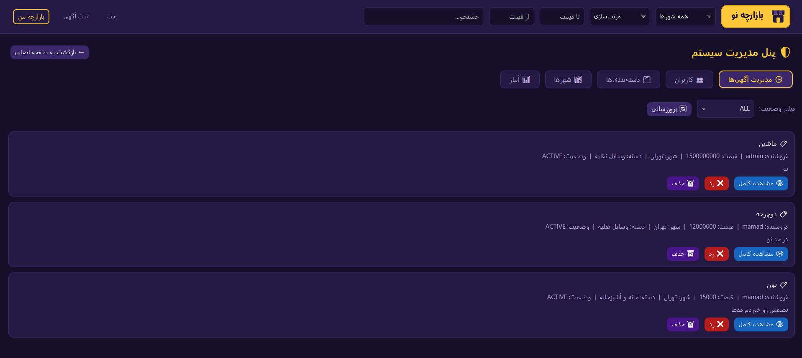
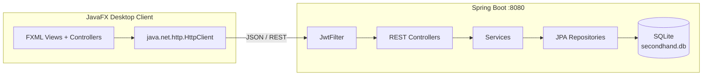

<div align="center">


# بازارچه دست‌دوم دپارتمان

سامانه خرید و فروش کالای دست‌دوم (مشابه دیوار) — پروژه درس برنامه‌سازی پیشرفته

**Java 17** · **Spring Boot 3** · **JavaFX 25** · **SQLite** · **JWT**

</div>

---

## معرفی

یک اپلیکیشن دسکتاپ تمام‌عیار برای خرید و فروش کالای دست‌دوم. بک‌اند با Spring Boot یک REST API کامل روی پورت 8080 ارائه می‌دهد و فرانت‌اند JavaFX با تم تیره بنفش–طلایی با آن ارتباط می‌گیرد.

## تصاویر محیط برنامه

| صفحه ورود | صفحه اصلی |
|:---:|:---:|
|  |  |

| ثبت آگهی جدید | لیست گفتگوها |
|:---:|:---:|
|  |  |

| گفتگوی خریدار و فروشنده | پنل مدیریت |
|:---:|:---:|
|  |  |

## امکانات

### حساب کاربری و امنیت
- ثبت‌نام و ورود با **شماره تلفن** (شناسه یکتاو غیرقابل تغییر حساب)
- احراز هویت مبتنی بر **JWT** با نشست یکتا (ورود از دستگاه دوم نشست قبلی را باطل می‌کند)
- رمز عبور هش‌شده با **BCrypt**، تغییر رمز با تأیید رمز فعلی
- نمایش/مخفی کردن رمز با آیکون تصویری میمون (می‌بیند / چشم‌ها را گرفته)
- نام کاربری قابل تغییر است و در تمام آگهی‌ها، گفتگوها و امتیازها به‌روز می‌شود (با چرخش خودکار توکن)
- ویرایش مشخصات فردی (نام، ایمیل، رمز) با چیدمان راست‌چین

### آگهی‌ها
- ثبت آگهی با چند عکس، انتخاب عکس اصلی، دسته‌بندی و زیردسته، شهر و قیمت
- چرخه تأیید: آگهی پس از ثبت در انتظار تأیید ادمین قرار می‌گیرد (PENDING / ACTIVE / REJECTED / SOLD)
- ویرایش و حذف آگهی (حذف با پاپ‌آپ تأیید)، علامت «فروخته شد»
- جستجو، فیلتر شهر و محدوده قیمت، مرتب‌سازی (جدیدترین / ارزان‌ترین / گران‌ترین) — همه ترکیب‌پذیر
- سایدبار دسته‌بندی درختی با زیردسته‌های بازشونده

### علاقه‌مندی‌ها و امتیاز
- افزودن/حذف آگهی به علاقه‌مندی‌ها با آیکون قلب (دکمه هوشمند: وضعیت فعلی را نشان می‌دهد)
- امتیازدهی ۱ تا ۵ ستاره به فروشنده — فقط توسط کسانی که درباره همان آگهی گفتگو کرده‌اند (هر کاربر یک امتیاز برای هر آگهی)

### گفتگو
- چت غیرهمزمان خریدار–فروشنده برای هر آگهی
- گفتگو فقط با ارسال **اولین پیام** ساخته می‌شود؛ زدن دکمه «شروع گفت‌وگو» به‌تنهایی گفتگویی ایجاد نمی‌کند
- لیست گفتگوها با آخرین پیام؛ گفتگو پس از حذف آگهی هم حفظ می‌شود (عنوان آگهی ذخیره می‌ماند)

### پنل مدیریت
- تأیید / رد آگهی‌ها (با یادداشت دلیل رد)
- مسدود / آزاد کردن کاربران
- مدیریت دسته‌بندی‌ها و زیردسته‌ها (افزودن/حذف با انتخاب دسته والد)
- آمار کلی سامانه

### رابط کاربری
- تم یکپارچه تیره بنفش–طلایی با فونت وزیرمتن و چیدمان RTL
- پاپ‌آپ‌های هماهنگ با تم فقط برای خطاها و تأیید حذف؛ بقیه بازخوردها به‌صورت اعلان کوتاه (Toast)

## معماری



| لایه | تکنولوژی                                                                            |
|---|-------------------------------------------------------------------------------------|
| بک‌اند | Java 25، Spring Boot 3.2، Spring Security، Spring Data JPA / Hibernate، JJWT 0.11.5 |
| دیتابیس | SQLite (فایل `secondhand.db` خودکار ساخته می‌شود)                                    |
| فرانت‌اند | JavaFX 25، FXML، Jackson (پنل ادمین)                                                |
| ارتباط | REST API روی `http://localhost:8080/api`                                            |

## ساختار پروژه

```
AP_Project_Completed/
├── backend/                  # سرور Spring Boot
│   └── src/main/java/com/example/backend/
│       ├── controller/       # REST کنترلرها (Auth, Advertisement, ChatRest, Admin, ...)
│       ├── model/            # موجودیت‌ها (User, Advertisement, Conversation, Message, ...)
│       ├── repository/       # ریپازیتوری‌های JPA
│       ├── security/         # JwtUtil و JwtFilter
│       ├── service/          # منطق اصلی (AuthService, AdvertisementService)
│       ├── config/           # SecurityConfig و DataSeeder
│       └── dto/              # آبجکت‌های انتقال داده
├── frontend/                 # کلاینت JavaFX
│   └── src/main/
│       ├── java/com/example/frontend/   # کنترلرها (HelloController, AdminPanelController, ...)
│       └── resources/com/example/frontend/  # FXML، لوگو و آیکون‌ها
├── docs/                     # تصاویر README
└── README.md
```

## پیش‌نیازها

- **JDK 25**
- **Apache Maven 3.8+**

## اجرا

۱. ابتدا بک‌اند را اجرا کنید:

```bash
cd backend
mvn spring-boot:run
```

سرور روی `http://localhost:8080` بالا می‌آید؛ دیتابیس و داده‌های اولیه (دسته‌بندی‌ها، شهرها و حساب ادمین) خودکار ساخته می‌شوند.

۲. سپس در ترمینال دوم فرانت‌اند را اجرا کنید:

```bash
cd frontend
mvn javafx:run
```

### حساب پیش‌فرض ادمین

| شماره تلفن | رمز عبور |
|---|---|
| `09000000000` | `admin123` |

## خلاصه API

| متد | مسیر | شرح |
|---|---|---|
| POST | `/api/register` | ثبت‌نام |
| POST | `/api/login` | ورود (با شماره تلفن) و دریافت توکن |
| POST | `/api/auth/logout` | خروج و ابطال توکن |
| GET | `/api/advertisements` | لیست آگهی‌ها (با فیلتر و جستجو) |
| POST | `/api/advertisements` | ثبت آگهی جدید |
| PUT / DELETE | `/api/advertisements/{id}` | ویرایش / حذف آگهی |
| POST | `/api/upload` | بارگذاری عکس |
| GET | `/api/categories` ، `/api/cities` | دسته‌بندی‌ها و شهرها |
| POST | `/api/chat/start` | بررسی وجود گفتگو (بدون ساختن) |
| POST | `/api/chat/send-first` | ارسال اولین پیام و ساخت گفتگو |
| GET | `/api/chat/conversations` | لیست گفتگوها |
| GET / POST | `/api/chat/conversations/{id}/messages` | دریافت / ارسال پیام |
| GET / POST | `/api/favorites` | علاقه‌مندی‌ها |
| GET / POST | `/api/ratings` | امتیاز فروشنده |
| GET / PUT | `/api/profile` | مشاهده / ویرایش پروفایل |
| * | `/api/admin/**` | عملیات مدیریتی (فقط نقش ADMIN) |

## نکات فنی مهم

- هر کاربر فقط یک نشست فعال دارد؛ توکن فعال در دیتابیس نگهداری و در هر درخواست مقایسه می‌شود.
- کاربران مسدودشده در لایه فیلتر JWT از تمام عملیات منع می‌شوند.
- عکس‌های آگهی در پوشه `uploads/` ذخیره و از مسیر `/uploads/**` سرو می‌شوند.
- تصاویر پوشه `docs/` اسکرین‌شات‌های واقعی از اجرای برنامه هستند.
