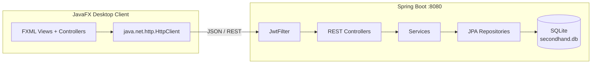

<div align="center">


# بازارچه دست‌دوم دپارتمان

سامانه خرید و فروش کالای دست‌دوم (مشابه دیوار) — پروژه پایانی درس برنامه‌سازی پیشرفته

**Java 17** · **Spring Boot 3** · **JavaFX 17** · **SQLite** · **JWT**

</div>

---

## ۱. معرفی پروژه

این پروژه یک **بازارچه آنلاین کالای دست‌دوم** به صورت اپلیکیشن دسکتاپ است که با معماری **Client–Server** پیاده‌سازی شده است:

- **Backend:** یک سرور Spring Boot که REST API کامل روی پورت `8080` ارائه می‌دهد و داده‌ها را در پایگاه‌داده SQLite ذخیره می‌کند.
- **Frontend:** یک کلاینت دسکتاپ JavaFX با تم تیره بنفش–طلایی و چیدمان راست‌به‌چپ (RTL) که از طریق HTTP با سرور ارتباط می‌گیرد.

کاربران می‌توانند ثبت‌نام کنند، آگهی ثبت کنند، آگهی‌ها را جستجو و فیلتر کنند، با فروشنده گفتگو کنند، آگهی‌ها را به علاقه‌مندی اضافه کنند و به فروشنده امتیاز بدهند. مدیر سامانه نیز آگهی‌ها را تأیید/رد و کاربران و دسته‌بندی‌ها را مدیریت می‌کند.

### اعضای گروه

| نام و نام خانوادگی | شماره دانشجویی |
|--------------------|----------------|
| پرهام پویان        | 40431066       |
| امیررضا پیروزازاد  | 40431411       |

## ۲. تکنولوژی‌های استفاده‌شده

| لایه | تکنولوژی                                                                           |
|---|------------------------------------------------------------------------------------|
| زبان | Java 25                                                                            |
| بک‌اند | Spring Boot 3.2 ، Spring Security ، Spring Data JPA / Hibernate                    |
| احراز هویت | JWT (کتابخانه JJWT 0.11.5 — الگوریتم HS256) و هش رمز با BCrypt                     |
| پایگاه‌داده | SQLite (فایل `secondhand.db`)                                                      |
| فرانت‌اند | JavaFX 25 ، FXML ، فونت وزیرمتن                                                     |
| ارتباط کلاینت–سرور | REST API با JSON روی `http://localhost:8080/api` (کلاس `java.net.http.HttpClient`) |
| ابزار build | Apache Maven                                                                       |

## ۳. پیش‌نیازهای اجرا

- **JDK 17** یا بالاتر (`java -version` را بررسی کنید)
- **Apache Maven 3.8+** (`mvn -version` را بررسی کنید)
- پورت `8080` آزاد باشد.
- نیازی به نصب پایگاه‌داده جداگانه نیست؛ SQLite به‌صورت فایل داخلی ساخته می‌شود.

## ۴. نحوه اجرای Backend

در ریشه پروژه، ترمینال را باز کنید و دستورات زیر را اجرا کنید:

```bash
cd backend
mvn spring-boot:run
```

سرور روی `http://localhost:8080` بالا می‌آید. در اولین اجرا:

- فایل پایگاه‌داده `secondhand.db` به‌صورت خودکار ساخته می‌شود.
- داده‌های اولیه (دسته‌بندی‌های پیش‌فرض، شهرها و حساب مدیر) توسط `DataSeeder` درج می‌شوند.

## ۵. نحوه اجرای Frontend

پس از بالا آمدن سرور، در یک **ترمینال دوم**:

```bash
cd frontend
mvn javafx:run
```

پنجره ورود برنامه باز می‌شود.

> **نکته:** اگر پس از تغییرات کد با خطای FXML مواجه شدید، یک بار با `mvn clean javafx:run` اجرا کنید تا خروجی‌های قدیمی build پاک شوند.

## ۶. روش ذخیره‌سازی داده‌ها

- داده‌ها در پایگاه‌داده **SQLite** ذخیره می‌شوند؛ فایل `secondhand.db` در پوشه `backend` هنگام اولین اجرا خودکار ساخته می‌شود و نیازی به راه‌اندازی دستی ندارد.
- ساخت و به‌روزرسانی جداول با **JPA/Hibernate** و تنظیم `spring.jpa.hibernate.ddl-auto=update` انجام می‌شود.
- عکس‌های آگهی‌ها در پوشه `uploads/` (کنار محل اجرای سرور) ذخیره و از مسیر `/uploads/**` سرو می‌شوند.
- فایل پایگاه‌داده و پوشه آپلودها جزو خروجی‌های محلی هستند و در مخزن قرار نمی‌گیرند (در `.gitignore` لحاظ شده‌اند)؛ با اولین اجرا دوباره ساخته می‌شوند.

## ۷. حساب‌های تست

| نقش | شماره تلفن (نام کاربری) | رمز عبور |
|---|---|---|
| مدیر (ADMIN) | `09000000000` | `admin123` |
| کاربر عادی | از صفحه «ثبت‌نام» یک حساب جدید بسازید | — |

> ورود با **شماره تلفن** انجام می‌شود. حساب مدیر در اولین اجرای سرور به‌صورت خودکار ساخته می‌شود.

## ۸. امکانات پیاده‌سازی‌شده

### حساب کاربری و امنیت
- ثبت‌نام و ورود با شماره تلفن (شناسه یکتا و غیرقابل تغییر حساب)
- احراز هویت مبتنی بر **JWT** با نشست یکتا (ورود از دستگاه دوم، نشست قبلی را باطل می‌کند)
- هش رمز عبور با **BCrypt** و تغییر رمز با تأیید رمز فعلی
- ویرایش پروفایل (نام، ایمیل، رمز)؛ تغییر نام در تمام آگهی‌ها، گفتگوها و امتیازها اعمال می‌شود

### آگهی‌ها
- ثبت آگهی با **چند عکس و انتخاب عکس اصلی** (گالری تصاویر )
- **دسته‌بندی درختی با زیردسته‌ها** در سایدبار
- چرخه تأیید آگهی: PENDING / ACTIVE / REJECTED / SOLD + نمایش دلیل رد به فروشنده
- ویرایش و حذف آگهی، علامت «فروخته شد»
- **جستجو و فیلتر ترکیبی** (متن + شهر + محدوده قیمت + دسته) و **مرتب‌سازی** جدیدترین / قدیمی‌ترین / ارزان‌ترین / گران‌ترین

### گفتگو (چت)
- چت غیرهمزمان خریدار–فروشنده برای هر آگهی
- گفتگو فقط با ارسال اولین پیام ساخته می‌شود
- **نمایش آخرین پیام در لیست گفتگوها** (امتیازی)؛ حفظ گفتگو حتی پس از حذف آگهی

### علاقه‌مندی و امتیازدهی
- افزودن/حذف آگهی به علاقه‌مندی‌ها با آیکون قلب
- امتیازدهی ۱ تا ۵ ستاره به فروشنده همراه با نظر — فقط برای کاربرانی که درباره همان آگهی گفتگو کرده‌اند
- صفحه پروفایل فروشنده با میانگین امتیاز و لیست نظرها

### پنل مدیریت
- تأیید / رد آگهی‌ها (با ثبت دلیل رد)
- **مسدود / آزاد کردن کاربران**  — کاربر مسدود در لایه JwtFilter از تمام عملیات منع می‌شود
- مدیریت دسته‌بندی‌ها و زیردسته‌ها (افزودن/حذف/تغییر نام با اعمال تغییر نام روی آگهی‌های قبلی)
- **داشبورد آمار کلی سامانه**

### مستندات
- **Javadoc** فارسی برای تمام کلاس‌ها و متدهای اصلی پروژه 

## ۹. تصاویر محیط برنامه

| صفحه ورود | صفحه اصلی |
|:---:|:---:|
|  |  |

| ثبت آگهی جدید | لیست گفتگوها |
|:---:|:---:|
|  |  |

| گفتگوی خریدار و فروشنده | پنل مدیریت |
|:---:|:---:|
|  |  |

## ۱۰. معماری و ساختار پروژه



```
AP_Project/
├── backend/                  # سرور Spring Boot
│   └── src/main/java/com/example/backend/
│       ├── controller/       # REST کنترلرها (Auth, Advertisement, ChatRest, Admin, ...)
│       ├── model/            # موجودیت‌ها (User, Advertisement, Conversation, Message, ...)
│       ├── repository/       # ریپازیتوری‌های JPA
│       ├── security/         # JwtUtil و JwtFilter
│       ├── service/          # منطق اصلی (AuthService, AdvertisementService)
│       ├── config/           # SecurityConfig و DataSeeder
│       └── dto/              # آبجکت‌های انتقال داده
├── frontend/                 # کلاینت JavaFX
│   └── src/main/
│       ├── java/com/example/frontend/       # کنترلرها (HelloController, AdminPanelController, ...)
│       └── resources/com/example/frontend/  # FXML، لوگو و آیکون‌ها
├── docs/                     # اسکرین‌شات‌های README
└── README.md
```

## ۱۱. خلاصه API

| متد | مسیر | شرح |
|---|---|---|
| POST | `/api/register` | ثبت‌نام |
| POST | `/api/login` | ورود و دریافت توکن |
| POST | `/api/auth/logout` | خروج و ابطال توکن |
| GET | `/api/advertisements` | لیست آگهی‌ها (با فیلتر، جستجو و مرتب‌سازی) |
| POST | `/api/advertisements` | ثبت آگهی جدید |
| PUT / DELETE | `/api/advertisements/{id}` | ویرایش / حذف آگهی |
| POST | `/api/upload` | بارگذاری عکس |
| GET | `/api/categories` ، `/api/cities` | دسته‌بندی‌ها و شهرها |
| POST | `/api/chat/send-first` | ارسال اولین پیام و ساخت گفتگو |
| GET | `/api/chat/conversations` | لیست گفتگوها |
| GET / POST | `/api/chat/conversations/{id}/messages` | دریافت / ارسال پیام |
| GET / POST | `/api/favorites` | علاقه‌مندی‌ها |
| GET / POST | `/api/ratings` | امتیاز فروشنده |
| GET / PUT | `/api/profile` | مشاهده / ویرایش پروفایل |
| * | `/api/admin/**` | عملیات مدیریتی (فقط نقش ADMIN) |

## ۱۲. سهم و مشارکت اعضای گروه

**پرهام پویان:**
بک وفرانت برای ثبت آگهی ها و مشاهده آگهی های خود و صفحه لاگین و ریجستر و اصلاح مشکلا ت در دسته بندی ها و شهر ها و انتخاب و آپلود تصاویر و علاقه مندی ها

**امیررضا پیروزازاد:**
پنل ادمین و انتخاب دسته بندی ها و فیلتر ها و آگهی های من و چت و بخش بازارچه من